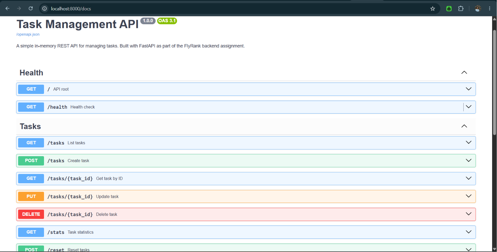

# Task Management API

Production-quality in-memory REST API for managing tasks, built with **FastAPI**, **Pydantic**, and **Uvicorn**.

All data lives in process memory and resets when the server restarts. No database is used.

---

## Project Overview

This project implements a complete Task Management API with:

- CRUD operations for tasks
- Input validation with clear JSON error responses
- Optional filtering, search, stats, and reset helpers
- Thin route handlers backed by a dedicated service layer
- Automated pytest coverage
- Auto-generated Swagger UI via FastAPI

---

## Tech Stack

| Layer | Technology |
|---|---|
| Language | Python 3.12 |
| Framework | FastAPI |
| Server | Uvicorn |
| Validation | Pydantic v2 |
| Package manager | pip |
| Tests | pytest + httpx |

---

## Folder Structure

```text
.
├── app/
│   ├── __init__.py
│   ├── main.py                 # FastAPI app + exception handlers
│   ├── core/
│   │   ├── config.py           # Settings
│   │   └── exceptions.py       # Domain exceptions
│   ├── models/
│   │   └── task.py             # In-memory Task model
│   ├── schemas/
│   │   └── task.py             # Request / response schemas
│   ├── services/
│   │   └── task_service.py     # Business logic
│   ├── routes/
│   │   ├── health.py           # GET /, GET /health
│   │   └── tasks.py            # Task endpoints + extras
│   └── utils/
├── tests/
│   ├── conftest.py
│   ├── test_health.py
│   └── test_tasks.py
├── requirements.txt
├── pytest.ini
├── .gitignore
└── README.md
```

---

## Installation

```bash
# Clone / enter the project
cd Assignment_1

# Create and activate a virtual environment
python -m venv .venv

# Windows PowerShell
.venv\Scripts\Activate.ps1

# macOS / Linux
source .venv/bin/activate

# Install dependencies
pip install -r requirements.txt
```

---

## Running the API

```bash
uvicorn app.main:app --reload --host 0.0.0.0 --port 8000
```

Then open:

- API: [http://localhost:8000](http://localhost:8000)
- Swagger UI: [http://localhost:8000/docs](http://localhost:8000/docs)
- ReDoc: [http://localhost:8000/redoc](http://localhost:8000/redoc)

---

## Running Tests

```bash
pytest
```

With coverage:

```bash
pytest --cov=app --cov-report=term-missing
```

---

## API Endpoints

| Method | Path | Status | Description |
|---|---|---|---|
| `GET` | `/` | 200 | Welcome message |
| `GET` | `/health` | 200 | Health check |
| `GET` | `/tasks` | 200 | List all tasks |
| `GET` | `/tasks/{id}` | 200 / 404 | Get one task |
| `POST` | `/tasks` | 201 / 400 | Create a task |
| `PUT` | `/tasks/{id}` | 200 / 400 / 404 | Update a task |
| `DELETE` | `/tasks/{id}` | 204 / 404 | Delete a task |
| `GET` | `/tasks?done=true` | 200 | Filter by completion |
| `GET` | `/tasks?search=text` | 200 | Search titles |
| `GET` | `/stats` | 200 | Aggregate counts |
| `POST` | `/reset` | 200 | Restore seed tasks |

### Seed data

The API starts with three example tasks:

| id | title | done |
|---|---|---|
| 1 | Buy groceries | `false` |
| 2 | Write documentation | `true` |
| 3 | Review pull request | `false` |

### Error format

```json
{
  "error": "Task 99 not found"
}
```

---

## Example curl commands

```bash
# Root
curl http://localhost:8000/

# Health
curl http://localhost:8000/health

# List tasks
curl http://localhost:8000/tasks

# Get one task
curl http://localhost:8000/tasks/1

# Create task
curl -X POST http://localhost:8000/tasks \
  -H "Content-Type: application/json" \
  -d "{\"title\": \"Ship feature\"}"

# Update task
curl -X PUT http://localhost:8000/tasks/1 \
  -H "Content-Type: application/json" \
  -d "{\"title\": \"Buy organic groceries\", \"done\": true}"

# Delete task
curl -X DELETE http://localhost:8000/tasks/1

# Filter completed tasks
curl "http://localhost:8000/tasks?done=true"

# Search titles
curl "http://localhost:8000/tasks?search=doc"

# Stats
curl http://localhost:8000/stats

# Reset to seed data
curl -X POST http://localhost:8000/reset
```

---

## Swagger screenshot placeholder

> 
>
> *Replace this placeholder with a screenshot of `http://localhost:8000/docs` after starting the server.*

Interactive docs are available at:

- Swagger UI: `http://localhost:8000/docs`
- OpenAPI JSON: `http://localhost:8000/openapi.json`

Every endpoint includes a summary, description, response model, status codes, and examples.

---

## Suggested commit history

Match assignment stages with small, reviewable commits:

| Stage | Suggested commit message |
|---|---|
| Stage 0 | `Stage 0: Hello server` |
| Stage 1 | `Stage 1: Root and Health endpoints` |
| Stage 2 | `Stage 2: Read endpoints for tasks` |
| Stage 3 | `Stage 3: Create task endpoint` |
| Stage 4 | `Stage 4: Update and Delete endpoints` |
| Stage 5 | `Stage 5: Swagger documentation polish` |
| Stage 6 | `Stage 6: README` |
| Extras | `Extras: filter, search, stats, reset, tests` |

---

## Assignment checklist

- [x] Python 3.12 + FastAPI + Uvicorn + Pydantic
- [x] Professional modular project structure
- [x] `GET /` and `GET /health`
- [x] Full task CRUD (`GET`, `POST`, `PUT`, `DELETE`)
- [x] In-memory storage only (no database / files)
- [x] Three seed example tasks
- [x] Status codes: 200, 201, 204, 400, 404
- [x] JSON errors like `{"error": "Task 99 not found"}`
- [x] POST/PUT title validation
- [x] Swagger with summary, description, response model, status codes, examples
- [x] Service layer (thin routes)
- [x] Clean exception handling
- [x] Optional extras: filter, search, stats, reset
- [x] pytest coverage for required scenarios
- [x] Professional README
- [x] Suggested staged git commit history

---

## License

Created for the FlyRank backend assignment.
